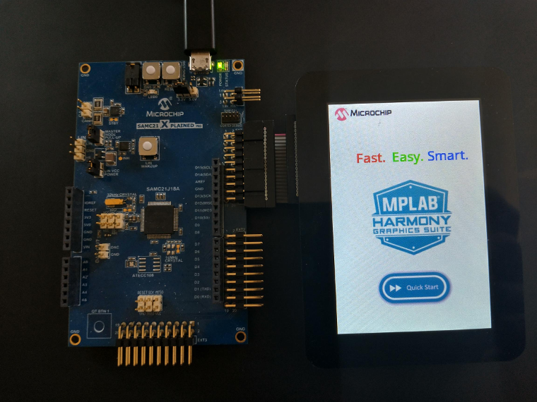

 legato\_qs\_c21\_xpro\_cpro.X

Defining the Architecture
-------------------------

This application demonstrates single-layer, 320 × 480 graphics using internal SRAM and SPI.

User touch input on the display panel is received thru the PCAP capacitive touch controller, which sends a notification to the Touch Input Driver. The Touch Input Driver reads the touch information over I2C and sends the touch event to the Graphics Library thru the Input System Service.

### Demonstration Features

-   16-bit color
-   SPI-based display communication

Creating the Project Graph
--------------------------

The Project Graph diagram shows the Harmony components that are included in this application. Lines between components are drawn to satisfy components that depend on a capability that another component provides.

Building the Application
------------------------

The parent directory for this application is gfx/harmony\_gfx\_apps\_sam\_c20\_c21/legato\_quickstart. To build this application, use MPLAB X IDE to open the gfx/harmony\_gfx\_apps\_sam\_c20\_c21/apps/legato\_quickstart/firmware/legato\_qs\_c21\_xpro\_cpro.X project file.

The following table lists configuration properties:

|Project Name|BSP Used|Graphics Template Used|Description|
|:-----------|:-------|:---------------------|:----------|
|legato\_qs\_c21\_xpro\_cpro.X|SAM C21 Xplained Pro|None|maXTouch Curiosity Pro|SAM C21 XPlained Pro with maXTouch Curiosity Pro over SPI|

> \*\*\_NOTE:\_\*\* This application may contain custom code that is marked by the comments // START OF CUSTOM CODE ... and // END OF CUSTOM CODE. When using the MPLAB Harmony Configurator to regenerate the application code, use the "ALL" merging strategy and do not remove or replace the custom code.

Configuring the Hardware
------------------------

The final setup should be:

Configure the hardware as follows:

-   Set all dip switches on the Curiosity Pro board to 1 to configure for 4W SPI mode.  
-   Attach the CPRO to the C21 XPRO's EXT1 connector using a 20pin ribbon cable.
-   Connect a USB cable from the host computer to the DEBUG USB port on the C21 CPRO board. This USB connection is used for power, code download and debugging.

The final hardware setup should be:

Running the Demonstration
-------------------------

When power-on is successful, the demonstration will display a similar menu to that shown in the following figure (different configurations may have slight variation in the screen aspect ratio):

* * * * *
