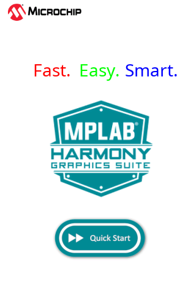

# Example Applications

The following applications are provided to demonstrate both basic and advanced Graphics capabilities of the SAM C20/C21 Family.

## Legato Library Examples 

* [Legato Quickstart](./legato_quickstart/readme.md)

This application provides a touch-enabled starting point for the legato graphics library.

